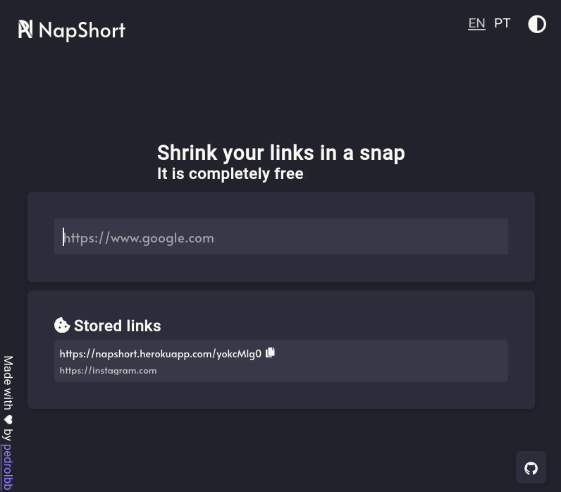

# NapShort

🚀 **NapShort** is a elegant and modern URL shortener built with NextJs and MongoDB
[https://napshort.herokuapp.com/](https://napshort.herokuapp.com/)



## Beware

You will need to change _next.config.js_ and provide your own mongo connection string

```
/** next.config.js */
const withImages = require('next-images')

module.exports = {
  withImages: withImages({ esModule: true }),
  env: {
    mongodburl: 'YOUR_MONGO_URL', // Your own String here!!
  },
  i18n: {
    locales: ['en-US', 'pt-BR'],
    defaultLocale: 'en-US',
  },
}
```

## Features

- [x] Free and open source

- [x] Responsive UI

- [x] Support for i18n english and portuguese

- [x] Dark theme

- [x] Store shortened urls in cookies

## Contributing

Pull requests are welcome 🤠

## License

**NapShort** is open source and is licensed under the MIT License
